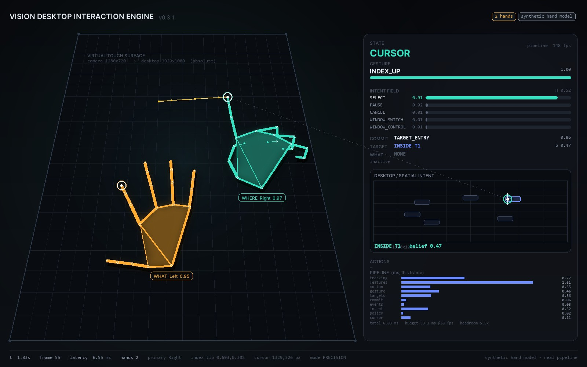
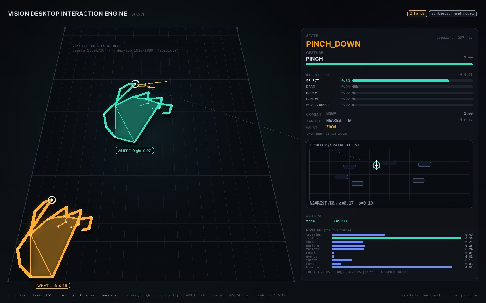

# Vision Desktop Interaction Engine (VDIE)

Управление Windows руками через веб-камеру: без мыши, без перчаток, без
маркеров на пальцах. Указательный палец одной руки ведёт курсор, вторая рука
отвечает за нажатия, перетаскивание и зум. Работает поверх обычного рабочего
стола.



## Что это

Движок. Он не рисует свой интерфейс и ничего не перехватывает
в системе: камера видит руки, движок превращает их движение в обычные действия
Windows - перемещение курсора, клики, перетаскивание, зум.

Руки делят роли. Одна отвечает на вопрос *где* - её указательный палец задаёт
положение курсора. Вторая отвечает на вопрос *что* - короткий щипок означает
левый клик, удержанный щипок - правый, щипок вместе с движением первой руки -
перетаскивание, два щипка одновременно - зум.

Наведение само по себе не нажимает: клик всегда отдельное действие второй руки,
поэтому курсор не «стреляет» по дороге к цели.

## Требования

- Windows 10 или 11, x64
- Python 3.11, 3.12 или 3.13 с лаунчером `py`
- Веб-камера или камера, подключённая как UVC-устройство

Модель руки (`models\hand_landmarker.task`) уже лежит в репозитории, качать
отдельно ничего не нужно.

## Запуск

Все команды выполняются из папки проекта. Чтобы в неё попасть, откройте папку
в проводнике, наберите `cmd` в адресной строке и нажмите Enter - консоль
откроется сразу в нужном каталоге.

**1. Установка.** Один раз, занимает несколько минут.

```cmd
setup.cmd
```

Скрипт создаёт `.venv` рядом с кодом и ставит зависимости. В конце должно
появиться `Setup complete.`

**2. Безопасная проверка камеры.** Управление мышью выключено, работает только
трекинг.

```cmd
camera_test.cmd
```

В окне видно кадр с камеры и скелет руки. Закрыть - `Esc` или `Q`.

**3. Боевой режим.**

```cmd
camera_live.cmd
```

Экстренная остановка - сжатый кулак или `Ctrl+C`. Кнопки мыши отпускаются при
выходе.

## Жесты

Ведущая рука ведёт курсор, вторая работает как модификатор.

| Действие | Жест |
|---|---|
| Переместить курсор | указательный палец ведущей руки |
| Левый клик | короткий щипок второй рукой |
| Правый клик | щипок второй рукой с удержанием |
| Перетаскивание | щипок второй рукой плюс движение ведущей |
| Зум | два щипка одновременно, развести или свести |
| Экстренная остановка | сжатый кулак |

Двойной клик - два коротких щипка подряд.

Прокрутка, выделение рамкой и панорамирование холста выключены по умолчанию
и включаются в `config\config.yaml`.



## Если что-то не работает

```cmd
diagnose.cmd
```

Показывает версии Python и библиотек, наличие модели и список доступных камер.

Камера по умолчанию - устройство `0`, картинка зеркалится по горизонтали: так
рука в кадре двигается в ту же сторону, что и курсор. Для другой камеры или
другой посадки это правится в `config\config.yaml` (`capture.device`,
`capture.flip_horizontal`) либо прямо в командной строке:

```cmd
run.cmd --source mediapipe --mode touch_surface --set capture.device=1 --set capture.flip_horizontal=false
```

## Калибровка

Из коробки кадр камеры растягивается на весь рабочий стол: левый верхний угол
кадра - левый верхний угол стола. Для работы этого достаточно.

Если нужно точнее - под конкретную камеру, комнату и посадку:

```cmd
calibrate_touch.cmd
```

Девять точек, после калибровки профиль сохраняется в
`config\calibration\touch_surface.json` и включается флагом:

```cmd
run.cmd --source mediapipe --mode touch_surface --set cursor.touch_surface_use_calibration=true
```

## Проверка сборки

```cmd
verify.cmd
```

Прогоняет тесты движка и синтетический сценарий. Настоящие мышь и клавиатура
при этом не задействуются.

Для прогона тестов нужен pytest - в основные зависимости он не входит, потому
что для запуска самого движка не нужен:

```cmd
.venv\Scripts\pip install pytest
```

Без него `verify.cmd` не падает: он пропускает тесты и выполняет синтетический
сценарий.

